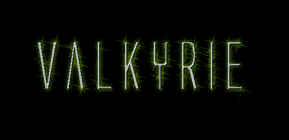

Valkyrie
========

A Java 2D space trading game...

Basic mechanics
---------------

* Implement the concept of allowed turns per go
* Implement the visiting of a planet
* Connect the planets via some sort of link
* Add the viewport
* Allow a user to view their cargo hold and current ship fittings
* Create config file for fittings (increase no. moves, )

Purchasing
----------

* Finish populating the products in market
* Create simple products in engineering bay
* Create the purchase item popup dialog or separate screen
* Allow user to purchase items
* Provide user with some form of initial credits

AI
--

* Create the AI player and implement the travel (search) and then buy
* AI Player context - material trader, rogue illegal goods trader etc...
* Decide on what happens when players meet (trade, attack?)

Missions
--------

* Create simple missions
